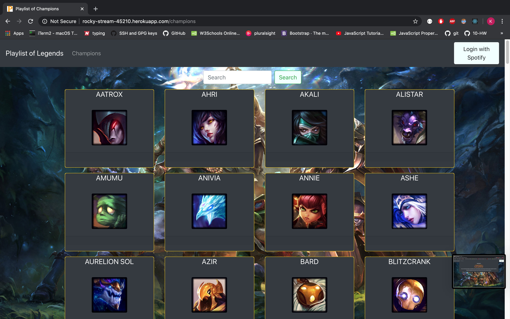

# Playlist of Legends

## Description

Our application is designed to help each individual user find a playlist for the champion they are currently playing on the hit game league of legends and allows them to save that playlist to their spotify account so that they can get in the right headspace for each champion.

## Table of Contents

* [Installation](#installation)
* [Usage](#usage)
* [Design](#design)
* [Contributors](#contributors)
* [Application](#application)
* [Repository](#repository)
* [License](#license)

## Installation

No installation necessary.

## Usage

On the main page, the user navigates to the list of champions from the navigation bar. All champions are displayed by card and selecting each card will navigate the user to a detailed summary of the champion their preferred genre of music. If the user has a Spotify account, the user can authenticate their credentials and listen to music directly with the app. With over 140 selectable champions to choose from, the app provides a search box that will allow the user to quickly find a champion whose choice in music the user can experience.

The following demonstrates general application functionality:

<!--  -->

## Design

<!-- List of champs and genre 
- embed code example:
 <iframe src="https://open.spotify.com/embed/playlist/2DsYfCPWDxZtFzHRj9mO4h" width="300" height="380" frameborder="0" allowtransparency="true" allow="encrypted-media"></iframe> -->

<!--  -->

## Contributors

    

## Application

[Deployed Site](https://rocky-stream-45210.herokuapp.com/)

## Repository

[Github Repository](https://github.com/pallavinama/Project3-Playlists-of-Legends)

## License

